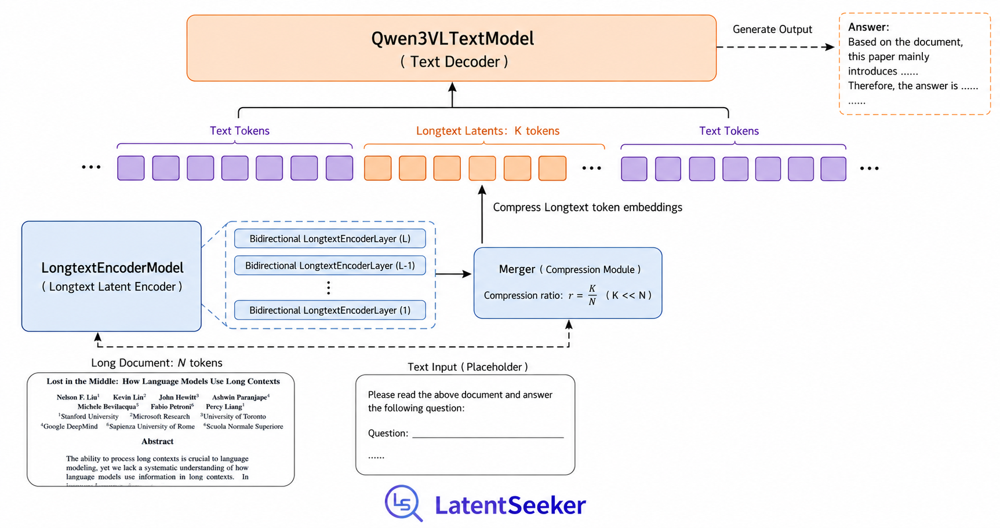

# LatentSeeker

Compress long text contexts into compact latent tokens, analogous to how vision-language models (like Qwen3-VL) compress images.



## Motivation

Long-context LLMs suffer from quadratic attention cost. LatentSeeker treats long documents the way VL models treat images — **compress first, process later**:

1. Long documents → **encoder** → compact latent tokens (e.g., 32 per doc)
2. Latent tokens replace `<|longtext_pad|>` placeholders in the text sequence
3. Text decoder runs on the compressed sequence → efficient generation

## Architecture

```
Input text: "Tell me about <|longtext_pad|>×N"
                          ↓
Long doc ─→ LongtextEncoder ─→ latent vectors (N tokens)
                          ↓
           masked_scatter replaces placeholders
                          ↓
              Qwen3VLTextModel (decoder)
                          ↓
                       lm_head
```

### LatentSeekerModel

| Submodule | Init | Description |
|-----------|------|-------------|
| `language_model` | Pretrained Qwen3VL | Text decoder backbone |
| `longtext.embed_tokens` | Copy from LM embed | Encoder token embedding |
| `longtext.layers` | Copy from LM layers | Bidirectional encoder blocks |
| `longtext.merger` | Random init | Pooling + MLP bridge to LM space |

### Generation flow

```python
messages = [
    {"role": "user", "content": [
        {"type": "longtext", "longtext": "War and Peace full text..."},
        {"type": "text", "text": "Summarize the main themes."},
    ]},
]

inputs = processor.apply_chat_template(messages, tokenize=True, return_tensors="pt")
outputs = model.generate(**inputs)
print(processor.decode(outputs[0]))
```

## Training

### Pretrain task: longtext repetition

Each sample contains a long document as both encoder input and decoder target. The model learns to compress the document into latent tokens and then reconstruct it.

### Progressive training plan

| Stage | Trainable | Frozen | Learning rate | Goal |
|-------|-----------|--------|---------------|------|
| 1 | `longtext.merger` | Everything else | 1e-3 | Bridge alignment: random init → stable mapping |
| 2 | `longtext.layers` + merger | `language_model` + embed_tokens | 1e-4 | Encoder learns bidirectional compression |
| 3 | `longtext.embed_tokens` + layers + merger | `language_model` | 1e-4 | Embedding adapts to encoder needs |
| 4 | All parameters | None | 1e-5 | Full fine-tune: LM adapts to latent inputs |

Between stages, save a checkpoint and resume with updated freeze config.

### Usage

```bash
# Stage 1: train merger only
python main.py --config_path configs/pretrain_stage1.yaml

# Stage 2: continue from stage1 checkpoint, train layers + merger
python main.py --config_path configs/pretrain_stage2.yaml \
    --model_name outputs/stage1

# Stage 3: add embed_tokens
python main.py --config_path configs/pretrain_stage3.yaml \
    --model_name outputs/stage2

# Stage 4: full fine-tune
python main.py --config_path configs/pretrain_stage4.yaml \
    --model_name outputs/stage3
```

## Components

| Module | Description |
|--------|-------------|
| `LatentSeekerEncoderModel` | Longtext encoder: embed → bidirectional blocks → merger |
| `LatentSeekerModel` | Encoder + Qwen3VLTextModel |
| `LatentSeekerForConditionalGeneration` | Full model with lm_head, GenerationMixin |
| `LatentSeekerProcessor` | Chat template, longtext placeholder insertion, assistant masking |

## Data preprocessing

```bash
# Single process, runs once per dataset
python src/dataset/preprocess_wiki.py \
    --input data/wiki/wiki.jsonl \
    --output data/wiki/processed_wiki
```

## Dependencies

- Python >= 3.10
- PyTorch >= 2.10
- transformers >= 5.3.0
- datasets
- deepspeed

## Design references

- [Qwen3-VL](https://huggingface.co/Qwen/Qwen3-VL-4B) — vision model pattern (flat concat + cu_seqlens, deepstack)
- [DeepStack](https://arxiv.org/abs/2406.04334) — multi-layer feature injection from encoder to decoder
