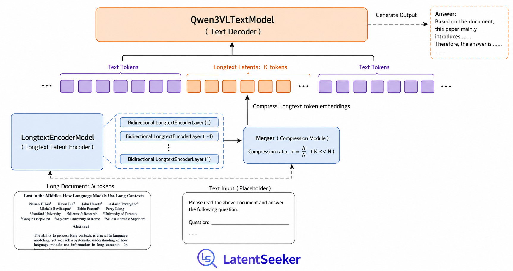

# LatentSeeker

Compress long text contexts into compact latent tokens, analogous to how vision-language models (like Qwen3-VL) compress images.



## Motivation

Long-context LLMs suffer from quadratic attention cost. LatentSeeker treats long documents the way VL models treat images — **compress first, process later**:

1. Long documents → **encoder** → compact latent tokens (e.g., 32 per doc)
2. Latent tokens replace `<|longtext_pad|>` placeholders in the text sequence
3. Text decoder runs on the compressed sequence → efficient generation

## Architecture

```
Input text: "Tell me about <|longtext_pad|>×N"
                          ↓
Long doc ─→ LongtextEncoder ─→ latent vectors (N tokens)
                          ↓
           masked_scatter replaces placeholders
                          ↓
              Qwen3VLTextModel (decoder)
                          ↓
                       lm_head
```

### LatentSeekerModel

| Submodule | Init | Description |
|-----------|------|-------------|
| `language_model` | Pretrained Qwen3VL | Text decoder backbone |
| `longtext.embed_tokens` | Copy from LM embed | Encoder token embedding |
| `longtext.layers` | Copy from LM layers | Bidirectional encoder blocks |
| `longtext.merger` | Random init | Pooling + MLP bridge to LM space |

### Generation flow

```python
messages = [
    {"role": "user", "content": [
        {"type": "longtext", "longtext": "War and Peace full text..."},
        {"type": "text", "text": "Summarize the main themes."},
    ]},
]

inputs = processor.apply_chat_template(messages, tokenize=True, return_tensors="pt")
outputs = model.generate(**inputs)
print(processor.decode(outputs[0]))
```

## Training

### Stage 1: Pretrain (repetition task)

Freeze encoder, embed_tokens, and language model — only the merger is trained.

Each sample presents a long document via `<|longtext_pad|>` placeholder. The model learns to compress it into latent tokens and reconstruct the original text, with **curriculum compression** gradually increasing the compression ratio from 1 → 5.

| Trainable | Frozen | LR | Compress ratio |
|-----------|--------|----|----------------|
| `longtext.merger` | `language_model` + `embed_tokens` + `longtext.layers` | 1e-3 | 1 → 5 (curriculum) |

```bash
python main.py --config_path configs/pretrain.yaml
```

### Stage 2: Multi-task SFT

Unfreeze encoder + embed_tokens + merger, keep language_model frozen. Mixed dataset training with two objectives:

- **Repetition** (wiki): continue learning document compression at fixed ratio 5
- **Multi-turn QA** (synthesized): learn to answer questions about the compressed document

| Trainable | Frozen | LR | Compress ratio |
|-----------|--------|----|----------------|
| `longtext.embed_tokens` + `longtext.layers` + `longtext.merger` | `language_model` | 1e-5 | 5 (fixed) |

```bash
python main.py --config_path configs/multitask_sft.yaml
```

## Components

| Module | Description |
|--------|-------------|
| `LatentSeekerEncoderModel` | Longtext encoder: embed → bidirectional blocks → merger |
| `LatentSeekerModel` | Encoder + Qwen3VLTextModel |
| `LatentSeekerForConditionalGeneration` | Full model with lm_head, GenerationMixin |
| `LatentSeekerProcessor` | Chat template, longtext placeholder insertion, assistant masking |

## Data preprocessing

```bash
# Single process, runs once per dataset
python src/dataset/preprocess_wiki.py \
    --input data/wiki/wiki.jsonl \
    --output data/wiki/processed_wiki
```

## Dependencies

- Python >= 3.10
- PyTorch >= 2.10
- transformers >= 5.3.0
- datasets
- deepspeed

## Design references

- [Qwen3-VL](https://huggingface.co/Qwen/Qwen3-VL-4B) — vision model pattern (flat concat + cu_seqlens, deepstack)
- [DeepStack](https://arxiv.org/abs/2406.04334) — multi-layer feature injection from encoder to decoder
